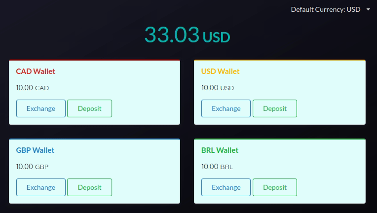

# Fiat Wallet
Wallet of Fiat currencies. Exchange and store your currencies in one platform.

## Description of chosen libs

* *create-react-app*: It has everything a developer might need in a medium to large project, possibility
of eject the app and further customize the configurations
* *redux-saga*: Better side effect management of async requests
* *semantic-ui-react*: A good(not ideal) CSS framework with enough components to build a pleasant UI without hassle

## Run the App

- Install dependencies with `npm install` or `yarn install`

In the project directory, you can run:

### `npm start` or `yarn start`

Runs the app in the development mode. 
Open [http://localhost:3000](http://localhost:3000) to view it in the browser.

The page will reload if you make edits. 
You will also see any lint errors in the console.

### `npm test`

Launches the test runner in the interactive watch mode. 
See the section about [running tests](https://facebook.github.io/create-react-app/docs/running-tests) for more information.

